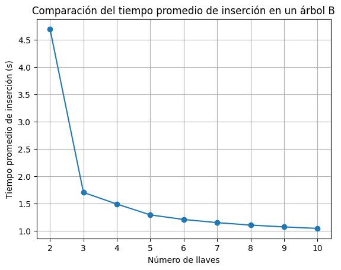

# INFORME DE ÁRBOLES TIPO B (B-TREES)    

## Integrantes: 

| Miembro | Participación % |
|---------|----------------|
| Huamani Huamani, Jhordan Steven Octavio | 100% |
| Flores Leon, Miguel Ángel | 100% |
| Ortiz Castañeda, Jorge Luis | 100% |

[Link del Laboratorio](https://github.com/JhordanSir/Estructura-de-Datos.git)

[Link de google colab](https://colab.research.google.com/drive/16VvB3DcuEzTFq2rke_pGOEFNPUe19vy6?usp=sharing)	


# Índice

[**Informe de Árboles Tipo B (B-TREES)**](#INFORME_DE_ÁRBOLES_TIPO_B_(B-TREES))
   - [Integrantes](#integrantes)
   - [1. Introducción](#1-introducción)
   - [2. Objetivo](#2-objetivo)
   - [3. Descripción del Experimento](#3-descripción-del-experimento)
     - [3.1. Parámetros](#31-parámetros)
     - [3.2. Métricas](#32-métricas)
     - [3.3. Herramientas](#33-herramientas)
     - [3.4. Modo de Ejecución](#34-modo-de-ejecución)
   - [4. Análisis de Resultados](#4-análisis-de-los-resultados)
     - [4.1. Librerías Utilizadas](#41-librerías-utilizadas)
     - [4.2. Función de Lectura](#42-función-de-lectura)
     - [4.3. Llamado de la Función y Resultados de Inserción](#43-llamado-de-la-función-y-resultados-de-inserción)
        - [4.3.1 Resultados Consola](#431-resultados-consola)
        - [4.3.2 Gráfica Inserción](#432-gráfica-inserción)
     - [4.4. Llamado de la Función y Resultados de Búsqueda](#44-llamado-de-la-función-y-resultados-de-búsqueda)
        - [4.4.1 Resultados Consola](#441-resultados-consola)
        - [4.4.2 Gráfica Búsqueda](#442-gráfica-búsqueda)
   - [5. Conclusiones](#5-conclusiones)
        
# Desarrollo del Informe

## 1. Introducción
Este repositorio contiene el código en C++ de los árboles tipo B y el código Python utilizado para analizar los tiempos de ejecución y de búsqueda de los árboles tipo B. Se emplearon múltiples ejecuciones para evaluar las velocidades de inserción y de búsqueda usando diferentes cantidades de llaves y se utilizó la biblioteca Pandas para organizar, analizar y visualizar los resultados obtenidos en los archivos txt.

## 2. Objetivo
El objetivo de este proyecto es cuantificar y comparar el rendimiento de las operaciones de inserción y búsqueda en árboles B, variando el número de llaves.

## 3. Descripción del Experimento

### 3.1. Parámetros
- Número de llaves por nodo: Se varió el número de llaves por nodo entre 2 y 10, con el objetivo de analizar cómo afecta la estructura del árbol en el rendimiento.
- Tamaño del conjunto de datos: Se insertaron un millón de datos en cada árbol, para evaluar el desempeño bajo cargas de trabajo significativas.

### 3.2. Métricas
- Tiempo de inserción: Se midió el tiempo transcurrido desde el inicio hasta la finalización de la inserción de un millón de datos en el árbol.
- Tiempo de búsqueda: Se midió el tiempo promedio de búsqueda de un elemento aleatorio dentro del árbol, repitiendo la búsqueda múltiples veces para obtener resultados más precisos.

### 3.3. Herramientas

- Lenguaje de programación: [Especificar el lenguaje utilizado, por ejemplo, Python, C++].
- Biblioteca Pandas: Se utilizó Pandas para organizar y analizar los datos obtenidos, calculando los promedios y generando visualizaciones.

### 3.4. Modo de ejecución

 ```C++

int main() {

    for (int i=2;i<=10;i++){//cantidad de llaves
        double lectura=0;
        double busqueda=0;
        archivoLectura<<i<<" ";
        archivoBusqueda<<i<<" ";
        for (int j=1;j<=20;j++){// cantidad de ejecuciones

            int max_claves=i;
            NodoArbolB *raiz = nullptr;

            // Inserción
            auto inicio = chrono::high_resolution_clock::now();
            
            cargarCSVEnArbolB(&raiz, "random_numbers_1000000.csv", 10, max_claves);

            auto fin = chrono::high_resolution_clock::now();

            chrono::duration<double> duracion = fin - inicio;
            lectura+=duracion.count();
            archivoLectura<<duracion.count()<<" ";
            
            // Búsqueda
            auto inicio2 = chrono::high_resolution_clock::now();

            cout<<buscarClave(raiz, 0.9218232253882106)<<endl;
            
            auto fin2 = chrono::high_resolution_clock::now();

            chrono::duration<double> duracion2 = fin2 - inicio2;
            busqueda+=duracion2.count();
            archivoBusqueda<<duracion2.count()<<" ";
        }

        archivoLectura<<lectura/20<<endl;
        archivoBusqueda<<busqueda/20<<endl;
    }
    
    return 0;
}

 ```

## 4. Análisis de los Resultados

### 4.1. Librerías Utilizadas

Para el análisis de los resultados se empleó Python, se usó matplotlib para la ilustración de los resultados obtenidos. Pandas para el manejo de los datos y files para cargar los archivos a la nube de google colab donde se ejecutó el código Python.

```Python
import pandas as pd
import matplotlib.pyplot as plt
from google.colab import files
```

### 4.2. Función de Lectura

```Python
def leer_archivo_txt(nombre_archivo):

    with open(nombre_archivo, 'r') as f:
        data = []
        for line in f:
            data.append(line.strip().split())

    df = pd.DataFrame(data, columns=['llaves'] + [f'ejecucion_{i+1}' for i in range(20)] + ['promedio'])

    for col in df.columns[1:]:
        df[col] = df[col].astype(float)

    return df
```

### 4.3. Llamado de la Función y Resultados de Inserción

```Python
nombre_archivo = "tiempos_lectura.txt" 
df = leer_archivo_txt(nombre_archivo)

print(df)
```

### 4.3.1. Resultados Consola

| llaves | ejecucion_1 | ejecucion_2 | ejecucion_3 | ejecucion_4 | ejecucion_5 |  ... | ejecucion_20 |   Promedio   |  
| ------ | ----------- | ----------- | ----------- | ----------- | ----------- |  --- | ------------ | ------------ |
|   2    |   4.68638   |   4.87824   |   4.80024   |   4.72905   |   4.67899   |  ... |   4.54841    |   4.69387    |
|   3    |   1.67280   |   1.74010   |   1.66358   |   1.76928   |   1.67349   |  ... |   1.80982    |   1.69829    |
|   4    |   1.45780   |   1.42823   |   1.48941   |   1.50340   |   1.43468   |  ... |   1.47492    |   1.48615    |
|   5    |   1.30430   |   1.28246   |   1.28655   |   1.25452   |   1.28134   |  ... |   1.27871    |   1.28699    |
|   6    |   1.17254   |   1.18987   |   1.22726   |   1.17912   |   1.21623   |  ... |   1.21680    |   1.20354    |
|   7    |   1.17879   |   1.15984   |   1.13178   |   1.13726   |   1.13473   |  ... |   1.20399    |   1.14522    |
|   8    |   1.07403   |   1.11285   |   1.10928   |   1.08105   |   1.13596   |  ... |   1.13618    |   1.10001    |
|   9    |   1.05452   |   1.04447   |   1.04598   |   1.07524   |   1.11577   |  ... |   1.10834    |   1.06705    |
|   10   |   1.01423   |   1.07125   |   1.01935   |   1.03820   |   1.07603   |  ... |   1.02313    |   1.03923    |

### 4.3.2. Gráfica Inserción

```Python
plt.plot(df['llaves'], df['promedio'], marker='o')
plt.xlabel('Número de llaves')
plt.ylabel('Tiempo promedio de inserción (s)')
plt.title('Comparación del tiempo promedio de inserción en un árbol B')
plt.grid(True)
plt.show()
```
El tiempo promedio de inserción en un árbol B disminuye a medida que aumenta el número de llaves por nodo.



Esta tendencia indica que al aumentar la capacidad de cada nodo (es decir, el número de llaves que puede contener), se reduce el tiempo necesario para insertar un nuevo elemento en el árbol. Esto se debe a que:

Menor altura del árbol: Al permitir más llaves por nodo, se reduce la altura del árbol, lo que implica menos niveles que recorrer durante una operación de búsqueda o inserción.
Menos divisiones de nodos: Al aumentar la capacidad de los nodos, se reducen las divisiones de nodos durante las inserciones, lo que implica menos operaciones y, por lo tanto, menos tiempo de ejecución.

### 4.4. Llamado de la Función y Resultados de Búsqueda

```Python
nombre_archivo = "tiempos_busqueda.txt" 
df = leer_archivo_txt(nombre_archivo)

print(df)
```

### 4.4.1. Resultados Consola

| Llaves | Ejecución 1 | Ejecución 2 | Ejecución 3 | Ejecución 4 | Ejecución 5 | ... | Ejecución 20 | Promedio |
|---|---|---|---|---|---|---|---|---|
| 2 | 0.000008 | 4.87824 | 4.80024 | 4.72905 | 4.67899 | ... | 4.54841 | 4.69387 |
| 3 | 0.000004 | 1.74010 | 1.66358 | 1.76928 | 1.67349 | ... | 1.80982 | 1.69829 |
| 4 | 0.000004 | 1.42823 | 1.48941 | 1.50340 | 1.43468 | ... | 1.47492 | 1.48615 |
| 5 | 0.000004 | 1.28246 | 1.28655 | 1.25452 | 1.28134 | ... | 1.27871 | 1.28699 |
| 6 | 1.17254 | 1.18987 | 1.22726 | 1.17912 | 1.21623 | ... | 1.21680 | 1.20354 |
| 7 | 1.17879 | 1.15984 | 1.13178 | 1.13726 | 1.13473 | ... | 1.20399 | 1.14522 |
| 8 | 1.07403 | 1.11285 | 1.10928 | 1.08105 | 1.13596 | ... | 1.13618 | 1.10001 |
| 9 | 1.05452 | 1.04447 | 1.04598 | 1.07524 | 1.11577 | ... | 1.10834 | 1.06705 |
| 10 | 1.01423 | 1.07125 | 1.01935 | 1.03820 | 1.07603 | ... | 1.02313 | 1.03923 |

### 4.4.2. Gráfica Búsqueda

```Python
plt.plot(df['llaves'], df['promedio'], marker='o')
plt.xlabel('Número de llaves')
plt.ylabel('Tiempo promedio de búsqueda (µs)')
plt.title('Comparación del tiempo promedio de búsqueda en un árbol B')
plt.grid(True)
plt.show()
```
El gráfico muestra una fluctuación en el tiempo promedio de búsqueda a medida que aumenta el número de llaves por nodo en el árbol B, en lugar de una tendencia clara de disminución o aumento.
Se esperaría que al aumentar el número de llaves por nodo, generalmente disminuye la altura del árbol. Menos niveles implican menos comparaciones y, en teoría, tiempos de búsqueda más rápidos.


Al aumentar el número de llaves por nodo tiende a reducir la altura del árbol, este efecto puede verse contrarrestado por otros factores, como la necesidad de realizar más comparaciones dentro de cada nodo. Es posible que exista un punto óptimo en el que el número de llaves por nodo balancea de manera ideal la altura del árbol y el costo de las comparaciones dentro de cada nodo.

## 5. Conclusiones

- Inserción: Se observó una tendencia general a la disminución del tiempo promedio de inserción al aumentar el número de llaves por nodo. Esto se alinea con la teoría, ya que una mayor capacidad de los nodos reduce la altura del árbol y, por consiguiente, el número de niveles a recorrer durante la inserción.
- Búsqueda: Los resultados de la búsqueda presentaron una variabilidad mayor, con una tendencia a disminuir pero con picos esporádicos alrededor del uso de llaves múltiplos de 5. Si bien se esperaba una mejora en el tiempo de búsqueda al disminuir la altura del árbol, otros factores podrían estar influyendo en los resultados.
- El número de llaves por nodo tiene un impacto significativo en el rendimiento de las operaciones de inserción y búsqueda. Un mayor número de llaves por nodo generalmente conduce a una mejor eficiencia en términos de tiempo de ejecución. Sin embargo, existe un punto óptimo donde el beneficio de reducir la altura del árbol se ve compensado por el costo de realizar más comparaciones dentro de cada nodo.

En resumen, los resultados obtenidos en este experimento confirman la eficiencia de los árboles B para gestionar grandes volúmenes de datos.
